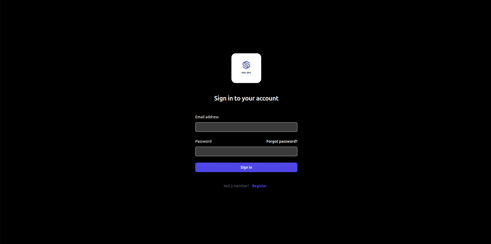

# PDF GPT: A modern document summarization AI tool



PDF GPT is an AI summarization tool that serves as a practical solution for condensing lengthy textual documents into succinct summaries. It can prove to be extremely useful for people with busy schedules who want to just upload a document, get its summary, and get going.

## How to setup PDF GPT on local

### Cloning the repo
First of all, make sure you have git on your system. See, [installing git](https://git-scm.com/book/en/v2/Getting-Started-Installing-Git) for further details on how to approach this. Once you have git installed, you
can open a terminal in the folder in which you want to setup the repository, and use git clone https://github.com/tanmaymunjal/pdf_gpt.git to git clone the repository into the folder.

### Installing nodejs and python
You would need to install nodejs and python to setup the project. You can follow [NodeJS Install guide](https://kinsta.com/blog/how-to-install-node-js/) and [Python Install Guide](https://realpython.com/installing-python/) to install Nodejs and Python respectively.

### Setting up the Backend

To setup the backend part of the application, you can follow the following steps :- \

i) Setup a python virtual environment using ``` 
python -m venv venv``` \

ii) Activate the [virtual environment](https://python.land/virtual-environments/virtualenv) \

iii) Setup the backend repo dependencies by running the ``` 
python setup.py install``` in PDF GPT repository.\

iv) Follow the [rabbitmq install](https://www.rabbitmq.com/docs/download) to setup rabbitmq on your computer. \

v) Create a rabbit mq user that you will use to authenticate requests to rabbit mq. For more details, check out [rabbitmq authentication guide](https://www.rabbitmq.com/docs/access-control).\

vi) Configure the application by creating a config.ini file in the backend, the format for the file should be
``` 
[OpenAI]
API_KEY=
MODEL=gpt-3.5-turbo-0125
[Application]
OTP_EXPIRY_TIME=300
SALT_LENGTH=16
DB=PDF_GPT
JWT_SECRET=
JWT_EXPIRY_TIME=1200
MAX_FREE_TRIAL_USAGE=5000
API_GATEWAY=http://127.0.0.1:8000
OTP_LENGTH=6
[SendGrid]
SENDER_EMAIL=
API_KEY=
[Notification]
API_KEY=
[Celery]
BROKER=
``` 
Many of these parameters are given as useful defaults but do note that all of these parameters are configurable. The meaning of most of these is quite clear from their name and placement.  
PDF GPT integrates with the OpenAI and SendGrid and you would need to provide authentication credentials for both of them in the configuration. Furthermore, the notification API key is a custom secure API key used to authenticate celery workers and can be set to anything as long as you deem it a sufficiently safe key. Similarly, the jwt secret will be a secret key used to authenticate and create jwt tokens.\
A celery broker URL will be needed to authenticate the user that you created earlier. Other useful parameters such as the OpenAI model used, otp length, otp expiry, salt length, etc. 

vii) Enter the backend folder in the PDF GPT repository and run the command  ``` celery -A celery_app worker --loglevel=info``` \
viii) Open a new terminal screen, activate the virtual environment in it, enter the backend folder,and run the command ```python3 mainapi.py``` in it.

**Note:** The API would still work if you do not turn on the celery worker, but none of the summarisation jobs will ever complete and will be in a perpetual state of pending.
### Setting up the Frontend

To setup the frontend part of the application, \
i) Open a new terminal and enter the frontend folder in the PDF GPT repository. \
ii) Run ``` npm i``` inside the folder to install all the node dependencies. \
iii) Run  ``` npm run dev``` to start the frontend.

**Note:** : Even though the frontend will turn on without the backend, none of the authentication or document summarization functionality would work. 
Furthermore, if your backend is running on a different location than localhost:8000, you would need to change the configured API HOST parameter in .env.local.```NEXT_PUBLIC_API_HOST=http://localhost:8000```